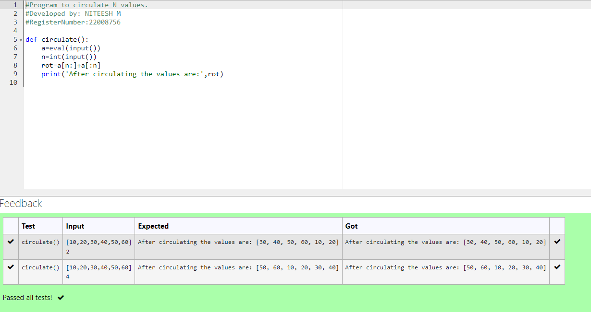

# Circulate-the-values-of-N-variables
## Aim:
To write a python program to circulate the n variables using function concept
## Equipment’s required:
PC
Anaconda - Python 3.7
## Algorithm: 
 Step 1:
Define the function circulate.

Step 2:
To calculate, enter the formula

Step 3:
Get the value from the user for the number of rotation

Step 4:
Using the slicing concept rotate the list

Step 5:
print the values after circulating.

Step 6:
End the program.
## Program:
```
#Program to circulate N values.
#Developed by: NITEESH M
#RegisterNumber:22008756

def circulate():
    a=eval(input())
    n=int(input())
    rot=a[n:]+a[:n]
    print('After circulating the values are:',rot)

```
## Output:


## Result:
Thus circulating n variables using functions concept is successfully executed.
